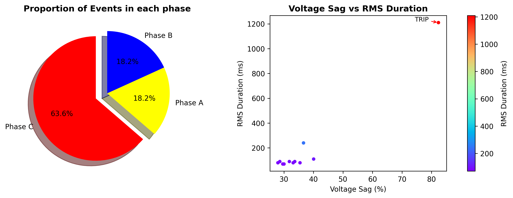

Automated analyzer for substation voltage disturbance reports (e.g., Voltage Sag, Swell, Interruption).  
Supports Fault Classification, Sequence Components Analysis, and Visualization tools.

<h1>⚡️ Substation Disturbance Analyzer 📉</h1>

<p>
Automated analyzer for substation voltage disturbance reports (e.g., Voltage Sag, Swell, Interruption).  
Supports Fault Classification, Sequence Components Analysis, and Visualization tools.
</p>


## 🚀 Features

- ✅ Voltage Sag %, Per-unit, RMS Duration (ms, cycles)
- ✅ Fault Type Classification (LG, LL, LLG, LLL)
- ✅ Current and Voltage Sequence Components (I0, I1, I2, V0, V1, V2)
- ✅ Severity & Note Inference
- ✅ Phase Impedance Calculation (Z∠θ)
- ✅ Export Results (.txt, .csv, .json)
- ✅ Easy to extend!

---

## 👨‍💻 Author

Sarawin Buakaew  
[Instragram](https://www.instagram.com/_srwbk_?igsh=MWJrZmhhb3RoMWk3ag%3D%3D&utm_source=qr) • [GitHub](https://github.com/sarawinb-engi)

## 📄 License

This project is licensed under the  License.

## 🚀 Usage

```bash
python3 disturbance_analyzer.py
```

## 📦 Installation

Create a virtual environment and install dependencies:

```bash
python3 -m venv venv
source venv/bin/activate  # On Windows: venv\\Scripts\\activate
pip install -r requirements.txt
```
